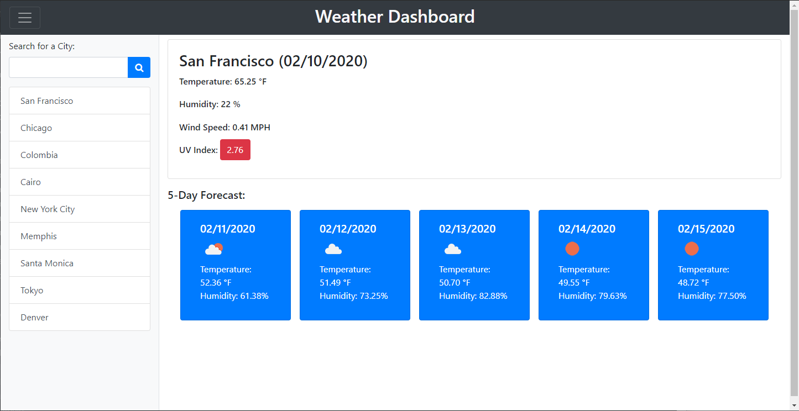

# Weather Dashboard

## Description
A simple, weather app with current forecasts for every city on Earth.

## How to Play

You can find the dashboard hosted by GitHub pages [here](https://millernj.github.io/weather-dashboard/). You can search by city for weather results with the search bar on the left, and your search history will be saved to local storage for future use. To access a previous search, just clikc on the entry. You can toggle the search area with the hamburger button on the top left (or top right if you're on mobile).